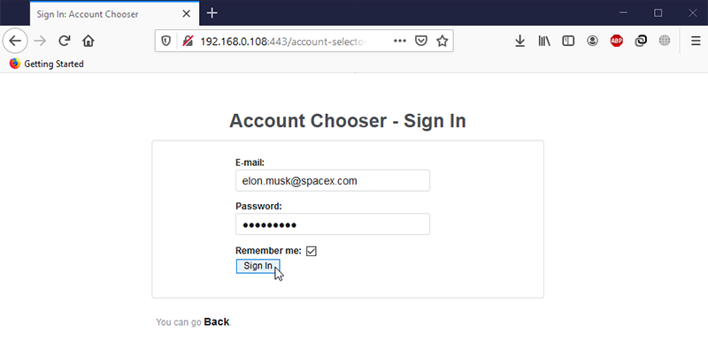
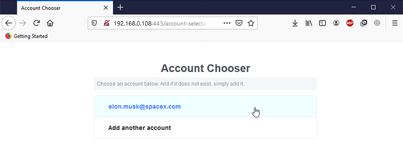

# Account Chooser

## Motivation
A sign in **account chooser** functionality which would list most recently used accounts, and allow to sign in with *ease*. Among many big tech platforms Google was the first platform to introduce a feature like this. Inspired by this, this repository tries to implement a similar feature that both Google and Facebook have. The implementation is done in PHP and JavaScript. 

## Account Chooser Feature
1. You fillout the fields, lets say, hypothetically speaking, that Elon Musk would sign in and he checks the **Remember me** checkbox.

2. Next time, the user, comes back to the site, he/she can easily select their account from the list. 

## Prerequisites
- Prior knowledge of PHP OOP
- [Apache 2.4.x](https://httpd.apache.org/)
- PHP 7.4.x (or any PHP 7.x)
- Enable **rewrite_module** in *httpd.conf* (Apache)
- [IIS Mod-Rewrite](http://www.micronovae.com/ModRewrite/ModRewrite.html)* (Windows-only)

## Note to Windows Users
I wrote all of the code from a **Windows PC**. If you are on Windows and decide to give this a try, make sure you have everything properly setup and configured prior.
Follow instructions here: https://www.furqansiddiqui.com/install-php-7-with-apache-2-on-windows-10/.

## Todos and Future Improvements
- [ ] Fix validity reporting in the login form
- [ ] Improve the *cryptography.php* class and make it more modular
- [x] Implement a delete an account from the list (*Ajax implemented*)
- [ ] Implement a remove all accounts (*Ajax implemented*)
- [ ] Improve this Readme - when I have more time

## Addendum
The aim of this project is to showcase some of the cool features, some of the most popular websites implement. The project can be downloaded and used in a real production environment. I am fully aware of the different security cryptographies that exist for PHP 7.4. Some of the older cryptographies have been depreciated. This project uses *openssl*, even if *libsodium* is built in. 

The reason for implementing with openssl over libsodium, is because of backward compatibility, e.g. if someone tries this under PHP 7.0 or 7.1. Additionally, openssl encryption has existed as far back as PHP 5 >= 5.3.0. 
However, in a real production environment libsodium would be much preferred. 

***Disclaimer**: I know that *Microsoft URL Rewrite Module 2.0 for IIS* exist, but, I also know that this module is not easy to use, therefore, I am proposing: IIS Mod-Rewrite by a third-party provider.

## ❤️ Contributing
First off, if you reached this section, thanks for considering to contribute! 

All types of contributions are encouraged and valued. If you know ways to improve anything in this project do not hesitate. The community looks forward to your contributions. 🎉 

## License
This PHP project is licensed under the [BSD 2-Clause License](LICENSE).
